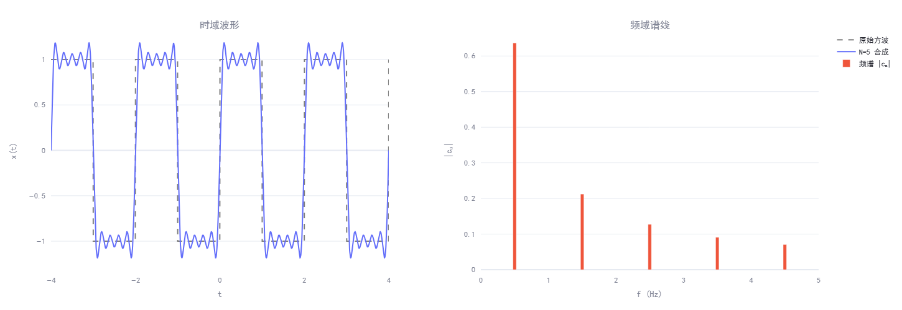
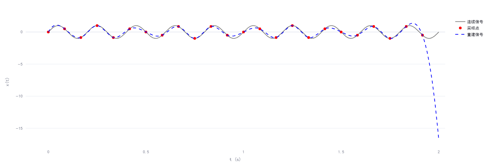
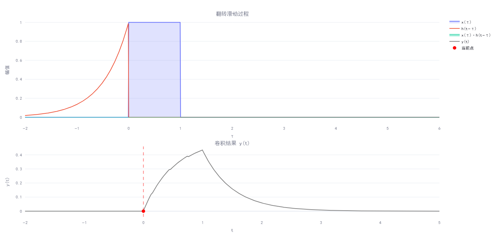
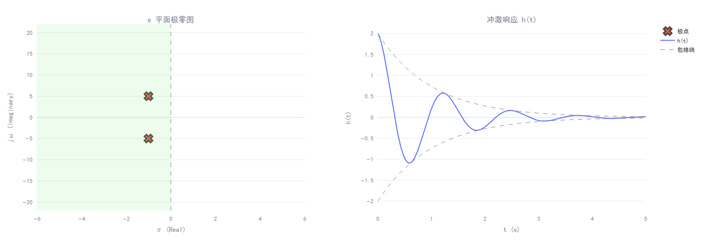
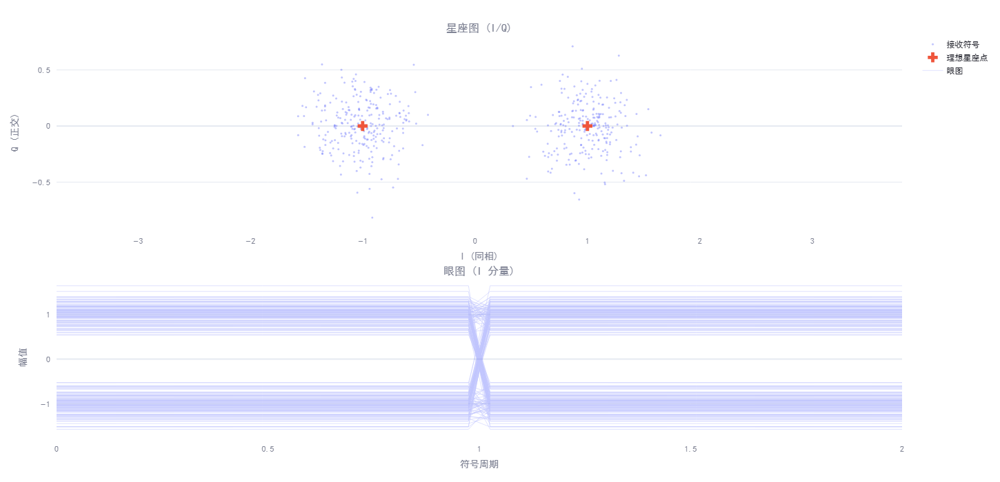
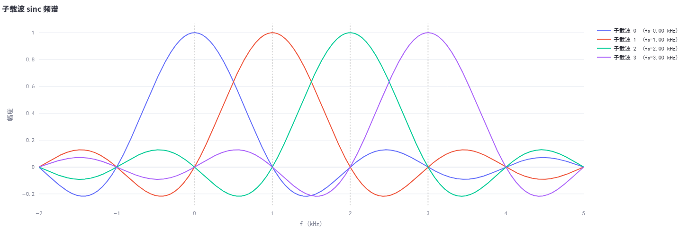

# SignalViz-Pro: 信号与系统核心考点交互式可视化研究


> Addressing the intuitive gap in understanding Signal Processing & 5G OFDM orthogonality.

## 研究动机

信号与系统是通信/电子/计算机考研的核心课程，但教材中的数学推导往往缺乏直觉支撑。傅里叶级数的吉布斯现象、采样定理的混叠效应、卷积的几何意义、系统稳定性与极点位置的关系、OFDM 子载波的正交条件——这些概念在纸面上是公式，在工程中是物理现实。

本项目通过 **交互式可视化** 的方式，将这些抽象概念转化为可操作、可观察的实验。每一个滑块的拖动都对应一次参数空间的探索，每一帧图表的变化都在验证一个数学定理。

## 可视化模块与对应考点

### 基础理论

**傅里叶级数与吉布斯现象** — 方波的奇次谐波叠加。拖动谐波数 N 从 1 到 101，观察合成波形逐步逼近方波，但间断点处的过冲始终稳定在约 9%。这就是 Gibbs Phenomenon：有限项傅里叶级数在不连续点处的固有超调，与 N 无关。



**采样定理与混叠效应** — 奈奎斯特准则 $f_s \geq 2f_{max}$ 的直观验证。当采样频率降到信号频率的两倍以下，三次样条插值重建的信号呈现出一个完全不同的低频波形——这就是混叠，也是 ADC 设计中必须用抗混叠滤波器的根本原因。



**卷积翻转滑动法** — LTI 系统响应 $y(t) = \int x(\tau)h(t-\tau)d\tau$ 的几何演示。翻转 $h(\tau)$，平移到位置 $t$，与 $x(\tau)$ 的重叠面积就是输出值。拖动滑块，绿色填充区域的面积变化实时映射到下方的卷积结果曲线。



### 系统与控制

**拉普拉斯变换与系统稳定性** — s 平面极零图与冲激响应的对应关系。共轭极点 $s = \sigma \pm j\omega$ 的实部 $\sigma$ 决定系统命运：左半平面衰减（稳定），右半平面发散（不稳定），虚轴上等幅振荡（临界稳定）。包络线 $\pm 2e^{\sigma t}$ 直观展示衰减/发散速率。



### 通信原理

**数字调制与 AWGN 噪声** — BPSK/QPSK/16QAM 星座图在不同 SNR 下的表现。高 SNR 时符号紧密聚集在理想位置，低 SNR 时噪声将符号扩散成"云团"，判决区域重叠导致误码。眼图的"眼睛"张开程度直观反映系统的抗噪声裕量。



**OFDM 子载波正交性** — 5G NR 的频域基石。多个子载波的 sinc 频谱在频域重叠，但当子载波间隔 $\Delta f = 1/T$ 时，每个 sinc 的峰值恰好对齐其他 sinc 的零点——这就是正交条件。偏离此条件时，载波间干扰 (ICI) 清晰可见。



## 技术实现

| 层次 | 技术选型 | 说明 |
|------|---------|------|
| Web 框架 | Streamlit | `st.navigation` 多页面路由，侧边栏交互控件 |
| 数学运算 | NumPy + SciPy | 向量化计算，广播矩阵，CubicSpline 插值 |
| 可视化 | Plotly | 交互式图表，支持缩放/平移/悬停数据提示 |
| 部署 | Streamlit Cloud | 零配置云端部署 |

核心设计决策：
- 所有数值计算使用 NumPy 广播矩阵运算，避免 Python 循环，确保交互流畅
- 卷积模块使用 `@st.cache_data` 预计算完整曲线，滑块交互仅触发单帧计算
- 眼图使用 `None` 分隔符将数百条轨迹合并为单条 Plotly trace，解决渲染性能瓶颈
- 拉普拉斯模块对 $e^{\sigma t}$ 做 `np.clip` 限幅，防止不稳定系统的指数溢出

## 本地运行

```bash
git clone <repo-url>
cd SignalViz-Pro
pip install -r requirements.txt
streamlit run app.py
```

## 项目结构

```
app.py              # 入口路由（三分组导航）
utils.py            # Plotly 共享样式配置
requirements.txt    # 依赖声明
pages/
  fourier.py        # 傅里叶级数与吉布斯现象
  sampling.py       # 采样定理与混叠
  convolution.py    # 卷积翻转滑动演示
  laplace.py        # 拉普拉斯变换与系统稳定性
  modulation.py     # 数字调制与噪声
  ofdm.py           # OFDM 子载波正交性
```

## Author

2027 Postgrad Candidate (SYSU/SCUT Target) | Signals & Systems, Communication Principles
